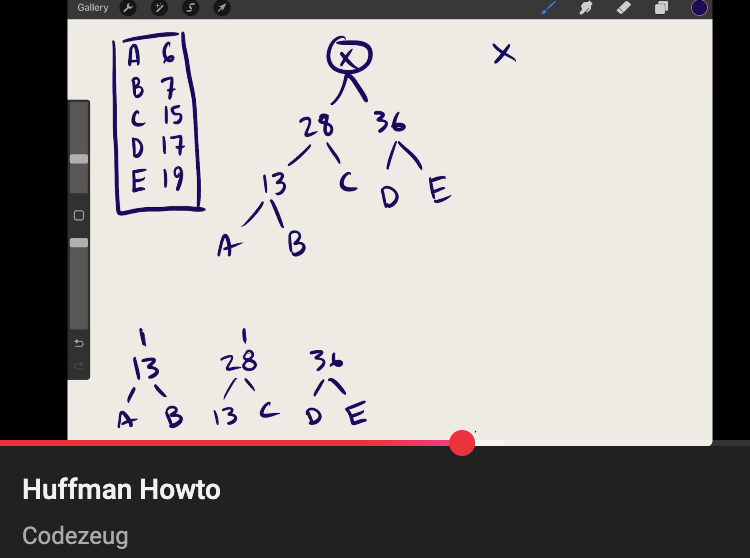
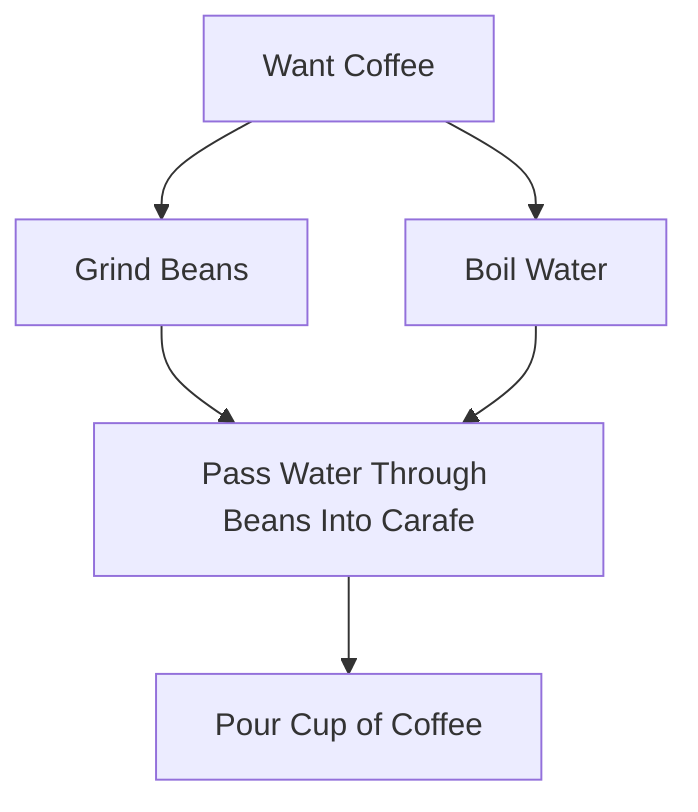
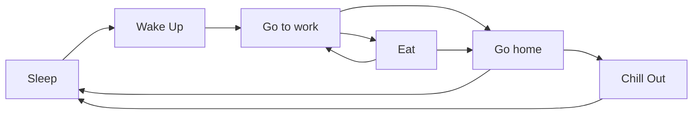
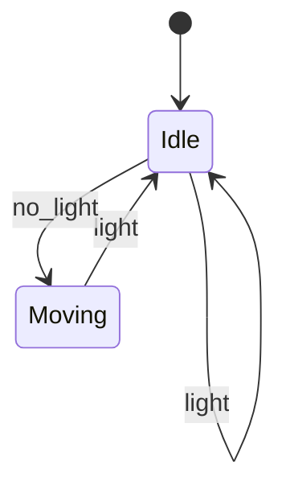
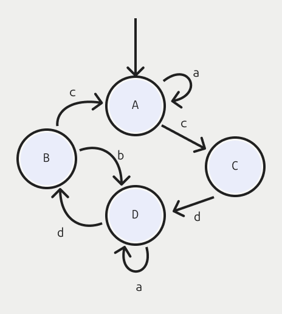

# ATLAS 2270 Spring 2025 Exam 2 Study Guide

Like last time: don't panic! Unless you don't study, haven't done the homeworks,
asked for help, etc. In that case, maybe panic? Or study. Studying would be
good.

Also like last time, this is a study guide and not a complete replacement for
the course content thus far.

The general vibe of the test will be the same as last time: a bunch of multiple
choice questions, diagram comprehension and production questions, etc.

# Topics and question types

The abstract topics from the first exam (references, recursion, complexity) are
fair game, especially complexity. There will be a question on complexity just
like last time.

In addition, it will address content we've had since the first exam:

1. **Abstract vs Concrete Data Types**, specifically implementing the priority
   queue ADT with a binary heap.
2. **Huffman Encoding** which is a multi-step process to build an encoding tree
   from some source corpus, followed by separate encode & decode algorithms. It
   uses the priority queue ADT.
3. **Graphs**, which model things and their relationships.
4. **State Machines**, which are useful for modeling user interaction in UIs,
   games, physical systems, etc.

# ADTs vs Concrete Types

An ADT defines what operations a structure supports. Maybe you can add and
remove items by index, check the structure's size, and query to see if it
contains a value. In that case, the ADT's interface is:

- Add Item `v`
- Remove Item at index `idx`
- Get Size
- Contains Value `v`

An ADT is _abstract_ because it doesn't define how the data type works. It only
defines what operations it supports.

A Concrete Type is an actual data structure that you can use, and if it does all
of the things that an ADT's interface specifies, you can say that it implements
the ADT. For example, a Javascript Array implements the anonymous ADT outlined
above.

In practice we have many ADTs that we refer to by name: Stacks, Queues, Priority
Queues, Lists, Sets, Maps, Graphs, and so on.

Those ADTs are often associated with specific data structures that implement
them efficiently. For example, a Priority Queue is often implemented by a
concrete data type called a Binary Heap.

## Binary Heaps

A binary heap is a useful structure for implementing a priority queue. It is
often drawn as a binary tree because that makes it easier for people to see the
relationships between parent and children nodes. But it is often stored in a
program in a list.

Binary heaps come in two flavors: _min_ heaps have smaller values towards the
top, and _max_ heaps have larger values towards the top.

A binary heap is filled top to bottom, left to right. It is not allowed to have
empty spaces.

To practice working with binary heaps, here are a few things to try:

First, pick five numbers at random. Then make binary trees out of them. By pure
chance, some of them will be valid min or max binary heaps, and others won't.
For the ones that aren't valid, ask yourself why not?

Second, pick five numbers at random. Then start with an empty binary heap. Be
sure to choose if it is min or max before you begin. Then add each number, one
at a time, to the heap. Where should it go? What should you do if the binary
heap invariant is broken? You'll need to repair it with the "repair up" routine.
When you've added everything, then run "extract" on the heap, one at a time,
being sure to "repair down" as necessary. Remember that the extract (aka "pop")
algorithm has you swapping the root value with the last value.

More things to think about:

- What's the runtime complexity of adding to and removing from binary heaps?
- How can you recognize a binary tree that isn't a binary heap? (In other words,
  do you know the invariants?)

## Huffman Encoding

You should check out the lectures for this for details, but the high level is
like this. Huffman encoding lets you compress data efficiently as long as the
things you want to compress come from a known alphabet.

The first step is to analyze a corpus of symbols so you can determine how often
each symbol appears. E.g. the letter `e` represents maybe 10% of the corpus, but
the letter `z` is only 0.1%, and the `🤯` emoji only 0.00001%.

Based on that frequency table, you can then create an encoding tree using a
priority queue. (See binary heaps for an implementing type for a priority
queue.) You add each symbol to the priority queue, prioritized by how _rare_ it
is (so, `🤯` will be at or near the front, and `e` near or at the back). From
this priority queue, pop two items. Combine them into a new node with left/right
children using the two items you popped, and it's priority is their frequency
sum. Add the new node back into the queue. Repeat this until you only have one
node in the queue. This node will be a tree that holds all the symbols in your
alphabet, with the common things only a few levels from the root, and the rare
ones much farther down.

The path from root to leaf represents how you'd encode the symbols at each leaf.
When you take a left path, output a `0`, right path outputs `1`. Common symbols
will have short bit strings, rare symbols will have long bit strings. An obvious
speedup is to create a lookup table where each symbol maps to a bit string. It
would look something like this (obviously I just made this up):

| Symbol | Bit String |
| ------ | ---------- |
| `e`    | 011        |
| `z`    | 101101     |
| `🤯`   | 0101100011 |

Then to decode a message (a bunch of bit strings glommed together) you can use
the encoding tree. Start at the beginning, and read bits. When you see a `0` go
left, see a `1` go right, and when you find a leaf node, that's the symbol.
Reset your cursor to the root of the tree and keep going until you run out of
bits.

The test will ask you about how to create an encoding tree, and another gives
you a message to encode. The two questions will be independent of one another.

✨ **Pro tip**: There's also [a video on how to approach a couple of the test
questions here](https://youtu.be/5nlFFl2aLVU).

# Graphs

Graphs model the relationship between items. Items could be people, companies,
colors, cities, tiles in a grid, abstract concepts, ... anything! These are the
nodes (or vertices) in a graph, and they're often drawn as boxes or circles.
Then you have their relationships, that model _how_ they are connected.
Relationships can be directional (they have arrows) or not (they are lines).

The two main kinds of traversal algorithms for graphs are _breadth_ first and
_depth_ first search (BFS vs DFS). You won't need to write any code for these,
but you should understand how they work. To be specific: breadth-first search
uses a queue to keep track of nodes that will be explored, while depth-first
search uses a stack.

## Queues and Stacks

We covered queues and stacks in the context of graphs, but they are useful data
structures independently of graphs as well.

### Stacks and example

Stacks let you "push" data onto the top, and then "pop" data from the top to
retrieve and remove data. With stacks, we only ever work with the top. We can
also "peek" at the data that is on top to retrieve but not remove it.

So imagine a stack of plates: the most recent thing we added to the stack will
be the next thing that we retrieve. Stacks have "last in, first out" (LIFO)
semantics.

As a sample question, pick five or so numbers. Say 8, 2, 3, 10, 5. Then flip a
coin. When you get a heads, push one of your numbers onto the stack. When you
get a tails, pop a value. (If you have a three-sided coin you could work _peek_
in there too, let me know how that goes). Let's say my coin flips tell me to do
this:

| operation | value | stack state after operation |
| --------- | ----- | --------------------------- |
| push      | 8     | 8                           |
| pop       | 8     | empty                       |
| pop       | -     | empty                       |
| push      | 2     | 2                           |
| push      | 3     | 2, 3                        |
| push      | 10    | 2, 3, 10                    |
| pop       | 10    | 2, 3                        |
| push      | 5     | 2, 3, 5                     |
| pop       | 5     | 2, 3                        |

### Queues and example

A queue is similar, except we keep track of the start and the end of the queue.
We add new values to the end of the queue, and retrieve items from the front.
Queues have "first in, first out" (FIFO) semantics, in contrast with stacks.

We can take take the exact same sequence as the stack example, same numbers and
same operations. In that case, here's how it would go:

| operation | value | queue state after operation |
| --------- | ----- | --------------------------- |
| push      | 8     | 8                           |
| pop       | 8     | empty                       |
| pop       | -     | empty                       |
| push      | 2     | 2                           |
| push      | 3     | 2, 3                        |
| push      | 10    | 2, 3, 10                    |
| pop       | 10    | 3, 10                       |
| push      | 5     | 3, 10, 5                    |
| pop       | 5     | 10, 5                       |

With queues we often say "enqueue" instead of "push", and "dequeue" instead of
"pop", but in practice you can use stack terms for queues and everybody knows
exactly what you mean.

## Directed acyclic graph

This is a graph that models the steps to make a cup of coffee. (It should look
like an actual diagram. If you see some terse syntax, try looking at this on
Github or install a Mermaid markdown viewer.)

The coffee graph is an example of a _directed acyclic graph_:

- It is **directed** because the edges have arrowheads. There is a distinct
  starting node ("Want Coffee") and ending node ("Grind Beans").
- It is **acyclic** because there are no loops - if you start at any node and
  follow the directed edges, you can not get back to where you started.

## Graph with cycles

Here is another graph, but this one is directed and _does_ have cycles:

In this graph, you're on an endless loop that involves sleeping, working, being
at home. Sometimes you get to eat and chill out, too, but only if they're on the
path you take. The whole thing is one big cycle. There's a small cycle, too,
because you can be at work, have lunch, and go back to work.

Of course you know this because you can read a flowchart, and a flowchart is
just one kind of graph. The difference is partly one of terminology. We don't
typically apply search algorithms to flowcharts, but if you call it a _graph_
suddenly you're fancy and can do such things.

# State Machines

A state machine consists of _States_, _Transitions_, _Signals_, and (sometimes)
_Actions_. When you see a state machine diagram, you probably understand exactly
how to use it without even needing to be told what it is!

Most state machines have a single _current state_. When the machine receives a
signal, it checks if there is a transition for that signal that originates from
that state, and if there is, that transition is taken. If an action is
associated with the transition, it will be invoked.

Actions are useful because they cause the state machine to do things. Otherwise,
the state machine can only be used to tell you what state it is in. This is
often exactly what you want, so actions are not always needed.

Imagine we have a little robot that is afraid of the dark. It will sit there in
the light, relaxing. But as soon as the lights go off, it starts moving around
looking for a bright spot again. When it detects light, it stops. This robot
might be modeled with the following finite state machine:

This diagram encodes the states, transitions, and signals, but it does not
mention the actions. You'll need to include the actions in your code when you
build it.

For the homework, actions were attached to transitions. You could also attach
actions to states, both for when you enter and exit them.

Consider this FSM:

1. What is the initial state?
2. What are the states?
3. What are the signals?
4. What signals will lead to a transition to be used if we are in state `A`?

Here's a sample question using this diagram.

> When a transition is taken, an action prints out the state the transition
> exits. For example, if the machine is in state C and it receives signal d, it
> prints C to output.
>
> What is printed if the state machine receives this input?
>
> `badcaabdqca`

Click here to show the answer

The printed output is `AACD`. The initial state is `A`. State machines will
ignore signals that don't match an outgoing transition for its current state. So
if you ignore the signals that don't match until you get one, _then_ you
transition from one state to the next and output the state you're exiting.

